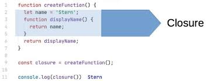

# Lecture 3
.png)
# Table of content ;
## 1.Recursive
## 2.Closure
# What is Recursion in Js?

## Recursive in metode hast ki dar daruni khudash khudashro ovoz mekunad Recursion is when a function calls itself until someone stops it. If no one stops it then it'll recurse (call itself) forever. Recursive functions let you perform a unit of work multiple times. Modern programming languages like JavaScript already have the for and while statements asalternatives to recursive functions. But some languages like Closure do not have any loopingstatements, so you need to use recursion to repeatedly execute a piece of code. Modern programming languages like JavaScript already have the for and while statements asalternatives to recursive functions. But some languages like Closure do not have any loopingstatements, so you need to use recursion to repeatedly execute a piece of code.
```
function get (num) {
    if(num == 0){
        return 0
    }
    retrn num + get(num - 1)
}
console.log(num(5))
```

# What is Closure in Js ? 
## Closure in funksie meboshad , ki dar daruni khudash iak funlksiai digar mesozad. A closure is the combination of a function bundled together (enclosed) with references toits surrounding state (the lexical environment). In other words, a closure gives youaccess to an outer function's scope from an inner function

```
function get(a) {
    return (b) => {
        return a+b
    }
}
console.log(get(1)(2)) --- > 3
```